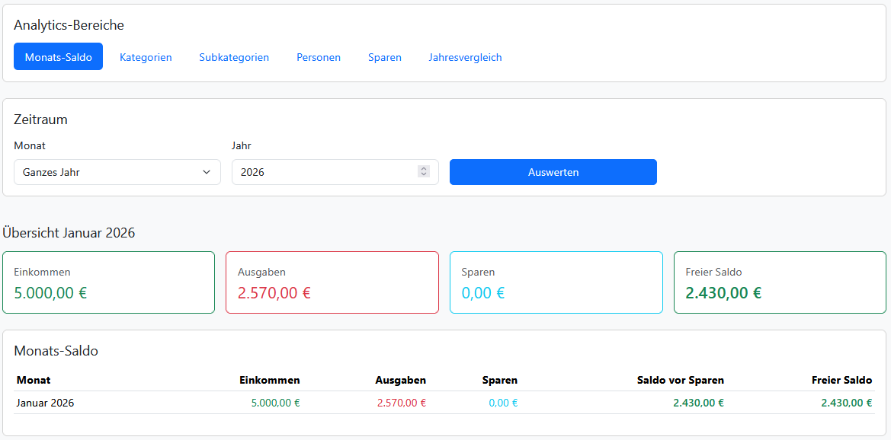
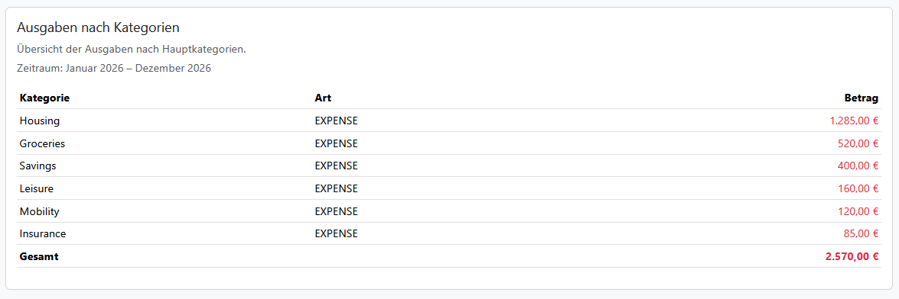
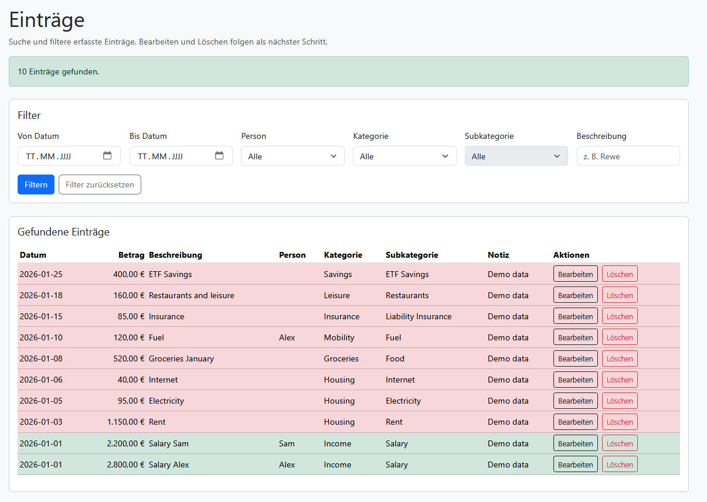

# Finance Planner

## Project Overview

Finance Planner is a personal household finance application designed to replace traditional spreadsheet-based budget tracking with a modern, visual and interactive web application.

The goal of the project is not only to record income and expenses, but also to make financial behavior understandable over time through structured data, filtering options and visual analytics.

The application is developed as a private learning and portfolio project with a practical real-life use case: long-term household budget planning, expense analysis and financial overview for families.

## Motivation

Many private household finance tools are either too complex, cloud-based or not flexible enough for individual planning needs.
This project focuses on a local, lightweight and customizable solution that allows users to track their finances transparently and analyze their spending behavior in detail.

## Core Features

### Data Tracking

* Create, edit and delete financial entries
* Track income and expenses
* Assign entries to categories and subcategories
* Assign entries to persons
* Store descriptions, notes and dates for each entry
* Separate income and expense categories

### Analytics

* Monthly balance overview
* Income, expense and savings calculation
* Expense summary by category
* Category-based analysis for selected time periods
* Monthly and yearly views
* Visual preparation for chart-based analysis

### Filtering and Time Selection

* Select specific months
* Select full years
* Prepare data for custom time ranges
* Analyze entries based on selected periods

## Screenshots

The following screenshots use a separate demo database with fictional data only.

### Analytics Overview

The analytics page provides an overview of income, expenses and balance for the selected time period.



### Category Expense Analysis

Expenses can be summarized by category to better understand the distribution of spending across different areas.



### Entries Overview

The entries overview shows individual transactions with their date, amount, description, category, subcategory and assigned person.



## Tech Stack

### Backend

* Java
* Spring Boot
* JDBC / Repository structure
* REST API
* SQLite database
* Spring Security with server-side sessions and BCrypt password hashes

### Frontend

* React
* JavaScript
* Bootstrap
* Chart.js

### Database

* SQLite
* Relational database schema
* Tables for persons, categories, subcategories and entries

## Local authentication setup

The application has no public registration. On startup, it creates the missing local users
`jonas` and `annina` only when their password environment variables are present. Existing users
and password hashes are never overwritten.

Set the variables in the terminal that starts the backend, for example in PowerShell:

```powershell
$env:FINANCE_PLANNER_JONAS_PASSWORD = '<choose-a-strong-local-password>'
$env:FINANCE_PLANNER_ANNINA_PASSWORD = '<choose-a-different-strong-local-password>'
mvn spring-boot:run -f backend/pom.xml
```

Do not put real passwords in `application.properties`, source files or Git. Passwords are stored
in SQLite only as BCrypt hashes. If a user was already created, changing the environment variable
does not reset that user's password.

`Person` and `User` deliberately remain separate concepts: a person is the household member to
whom a financial entry belongs; a user is the authenticated person who created or last edited the
record. Both users share and can edit the complete household dataset. Analytics therefore remains
household-wide and is not filtered by the logged-in user.

## Session, CSRF and frontend origin

Authentication uses an HTTP-only `JSESSIONID` cookie. The React app first retrieves a CSRF token
from `/auth/csrf` and sends it in the `X-XSRF-TOKEN` header for every modifying request. Every API
request uses `credentials: 'include'`, so a browser reload restores the existing backend session
through `/auth/me`.

For local Vite development, the only permitted browser origin is `http://localhost:5173`. Override
it for another deployment with `FINANCE_PLANNER_FRONTEND_ORIGIN`; this must be one exact trusted
origin, not `*`. When serving over HTTPS, also set `FINANCE_PLANNER_SECURE_COOKIES=true`. The local
default is `false` so cookies work on plain `http://localhost`.

The frontend API address defaults to `http://localhost:8080` and can be changed at build or dev
startup with `VITE_API_BASE_URL`.

## Current Status

The project has already progressed beyond the initial planning phase.

### Implemented

* Database schema designed and created
* SQLite database integrated
* Backend project structured with Spring Boot
* Repository layer implemented
* Service layer implemented
* REST controller layer implemented
* Basic CRUD operations implemented
* Persons, categories, subcategories and entries modeled
* REST endpoints prepared for frontend communication
* React frontend created
* Basic page structure implemented
* Analytics page implemented
* Monthly balance section implemented
* Expense analysis by category implemented
* Entries overview implemented
* Time-based selection for month and year implemented
* Configurable database path via application properties
* Separate demo database prepared for screenshots and presentation purposes

### In Progress

* Improving the analytics dashboard
* Adding more visual chart components
* Refining category and subcategory analysis
* Improving the user interface
* Expanding backend analytics endpoints
* Preparing additional portfolio-ready screenshots

## Planned Features

### Visualizations

* Doughnut charts for category distribution
* Subcategory breakdown within a selected category
* Year-over-year comparison using bar charts
* Income vs. expenses over time using line charts
* More detailed dashboard views

### Extended Finance Planning

* Budget planning per category
* Monthly limits and warnings
* CSV export
* Long-term financial planning
* Multi-user support

## Project Goals

The main goals of this project are:

* Building a complete full-stack application from database to frontend
* Improving practical experience with Java, Spring Boot and React
* Designing a clean and maintainable backend structure
* Working with relational data models
* Creating useful analytics from financial data
* Developing a project with a realistic private use case
* Handling local and demo data separately to avoid exposing personal information

## Learning Focus

This project helps strengthen several important software development skills:

* Backend development with Java and Spring Boot
* REST API design
* Database modeling and SQL
* Repository and service layer structure
* Dependency injection with Spring
* Frontend development with React
* State management and component-based UI design
* Data visualization with Chart.js
* Git-based version control
* Iterative project development

## Future Ideas

* Authentication and multi-user support
* Budget targets per category
* CSV import and export
* Recurring monthly entries
* Notifications for budget limits
* More advanced financial forecasts
* Deployment as a local or self-hosted web application
